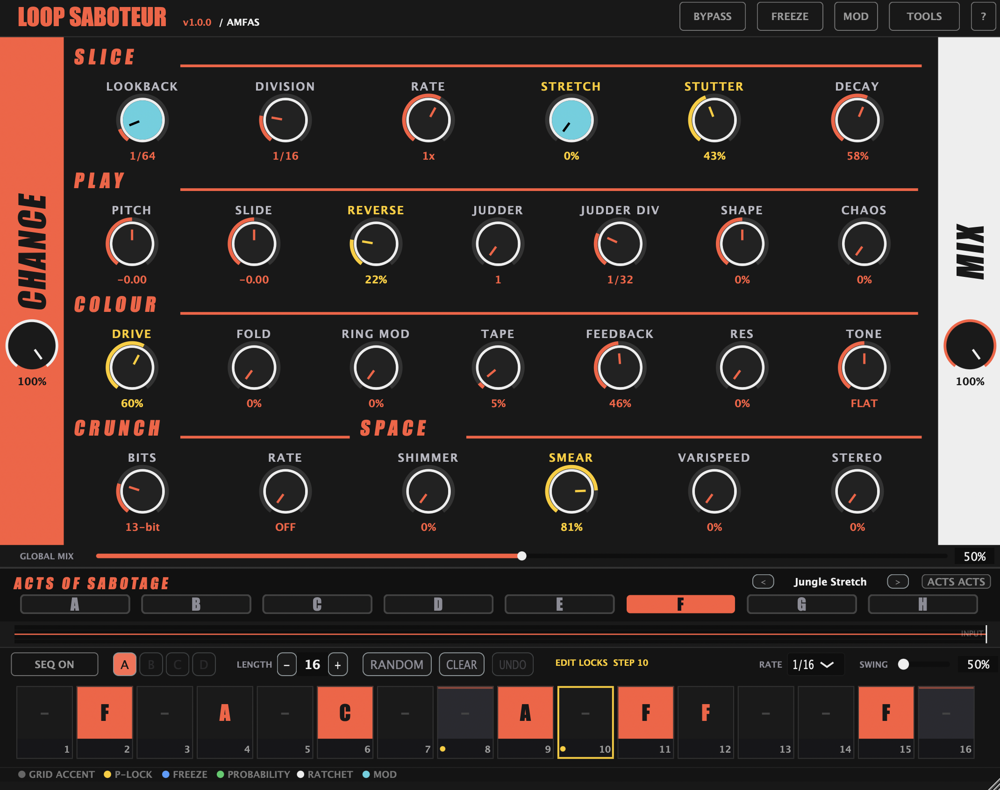
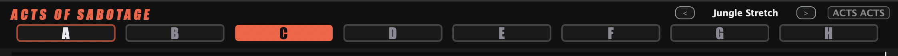
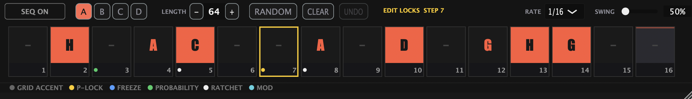
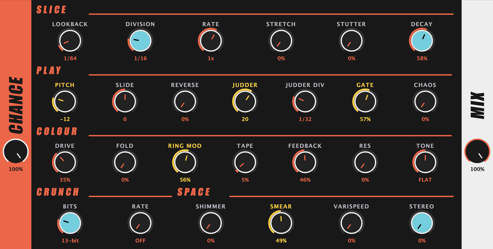
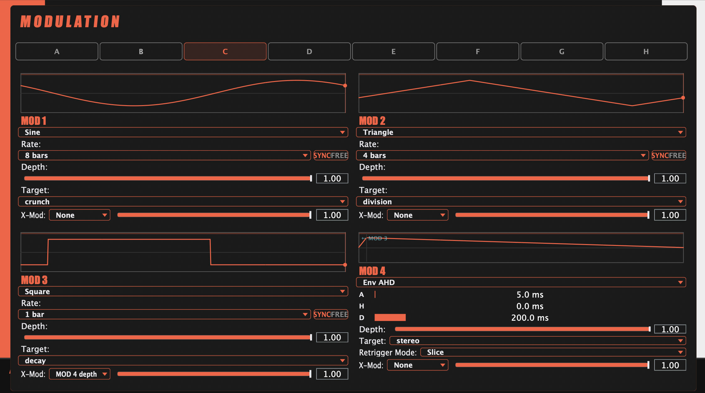

# Loop Saboteur — Manual

*A glitch / beat-slicer / buffer-destroyer for AU and VST3.*
*Version 1.0.0.*

---

## What it is

Loop Saboteur sits in an insert slot and watches the audio going past. It keeps a rolling recording of the last few bars in a circular buffer. When the plugin decides to fire — which it does either on a host-synced grid or a free-running clock — it reaches back into that buffer, grabs a slice, and plays it back through a chain of voice-shaping, tonal, degradation and motion effects before mixing it against the dry signal.

The creative surface is built around eight **Acts** (A through H), each of which is a complete snapshot of every knob plus four dedicated LFOs. Acts get stamped onto a 64-step sequencer, or fired freely based on probability. Add parameter locks, per-step ratios, ratchets, mutes and freezes on top, and you have a plugin that can turn any incoming loop into something unrecognisable — or something musical.

**Channel configurations:** stereo → stereo, mono → mono, and mono → stereo. The mono → stereo option lets you load the plugin on a mono track while still using stereo-widening effects (Stereo knob, stereo Output Stages). The plugin copies the mono input to both channels before processing.

---

## Quick start (5 minutes)

1. Drop Loop Saboteur on a track that has a loop running.
2. You'll hear the dry signal plus a random Act firing every so often. Good start.
3. Click any of the buttons **A**-**H** at the top to load that Act. Try a few — each one is a different personality.
4. Hit **SEQ** in the sequencer header. Now the plugin ignores random firing and plays from the 16-step grid instead. Click a cell to stamp the currently-selected Act there.
5. Right-click a stamped cell. Try **Trig condition > 1:2** — that step now only fires every other pattern cycle.
6. Hit **MOD**. You're now looking at the four LFOs for the currently-selected Act. Set MOD 1's **Target** to PITCH, depth to 0.5, rate to 1/4. Hit **MOD** again to return. The pitch knob is now wobbling.
7. Right-click any knob. Pick **Assign to MOD 2**. That's the other way to attach a MOD. Any knob with a MOD assigned shows a cyan body ring. Some knobs (TONE, RES, BITS, RATE) show extra options in the right-click menu — try right-clicking TONE to switch between filter modes.

That's the loop. The rest of this manual explains the depth.

---

## The interface at a glance



The window, top to bottom:

1. **Knob rows** — five categories across four rows. SLICE / PLAY / COLOUR each get their own row; CRUNCH and SPACE share the bottom row. CHANCE lives on the left edge, MIX on the right.
2. **Acts of Sabotage strip** — the eight Act buttons (A–H), preset browser, and ACTS ACTS bulk menu. The selected Act is highlighted orange.
3. **Waveform strip** — scrolling peak history so you can see what the plugin is listening to. Click the strip to toggle **Slice view**, which overlays a cyan waveform showing the most recent slice's post-FX output alongside the input peaks.
4. **Sequencer grid** — SEQ ON, length, random, clear, undo, rate, and swing controls in the header row, then 16 step cells per page; pages A/B/C/D expand that to 64 steps total.
5. **Footer legend** — colour key for grid accent, p-lock, freeze, probability, ratchet, and MOD indicators.

---

## Signal flow

<svg viewBox="0 0 720 290" xmlns="http://www.w3.org/2000/svg" style="max-width:100%;background:#1a1a1a;border-radius:6px">
  <style>.lbl{font:11px 'Courier New',monospace;fill:#ebebf0}.small{font:9px 'Courier New',monospace;fill:#888}.hdr{font:bold 11px 'Courier New',monospace;fill:#FF5A3C}.box{fill:#2a2a2a;stroke:#888;stroke-width:1;rx:3}.accbox{fill:#3a2a10;stroke:#FF5A3C;stroke-width:1.5;rx:3}.modbox{fill:#0a2a2a;stroke:#00CCFF;stroke-width:1.5;rx:3}.arr{fill:none;stroke:#FF5A3C;stroke-width:1.5;marker-end:url(#a)}.arr2{fill:none;stroke:#888;stroke-width:1;marker-end:url(#a2)}.modarr{fill:none;stroke:#00CCFF;stroke-width:1;marker-end:url(#am);stroke-dasharray:3,2}</style>
  <defs><marker id="a" viewBox="0 0 10 10" refX="9" refY="5" markerWidth="8" markerHeight="8" orient="auto"><path d="M0,0 L10,5 L0,10 z" fill="#FF5A3C"/></marker><marker id="a2" viewBox="0 0 10 10" refX="9" refY="5" markerWidth="8" markerHeight="8" orient="auto"><path d="M0,0 L10,5 L0,10 z" fill="#888"/></marker><marker id="am" viewBox="0 0 10 10" refX="9" refY="5" markerWidth="6" markerHeight="6" orient="auto"><path d="M0,0 L10,5 L0,10 z" fill="#00CCFF"/></marker></defs>
  <rect class="box" x="155" y="8" width="250" height="24"/>
  <text class="lbl" x="168" y="24">SEQUENCER / FREE-RUN trigger</text>
  <line class="arr" x1="205" y1="32" x2="205" y2="98"/>
  <line class="arr" x1="305" y1="32" x2="305" y2="98"/>
  <rect class="modbox" x="470" y="8" width="240" height="24"/>
  <text class="lbl" x="478" y="24" fill="#00CCFF">MODs 1–4 (LFO / AHD per Act)</text>
  <line class="modarr" x1="520" y1="32" x2="205" y2="98"/>
  <line class="modarr" x1="560" y1="32" x2="305" y2="98"/>
  <line class="modarr" x1="600" y1="32" x2="430" y2="98"/>
  <line class="modarr" x1="640" y1="32" x2="545" y2="98"/>
  <text class="small" x="478" y="46" fill="#00CCFF">x-mod: MODs can modulate each other's depth</text>
  <rect class="box" x="10" y="100" width="55" height="30"/>
  <text class="lbl" x="16" y="119">INPUT</text>
  <rect class="box" x="80" y="100" width="85" height="30"/>
  <text class="lbl" x="86" y="119">RING BUF</text>
  <text class="small" x="86" y="145">(circular, ~8 bar)</text>
  <rect class="accbox" x="180" y="100" width="75" height="30"/>
  <text class="hdr" x="192" y="119">SLICE</text>
  <text class="small" x="180" y="155">lookback/div/rate</text>
  <text class="small" x="180" y="167">stretch/stutter/dec</text>
  <rect class="accbox" x="270" y="100" width="75" height="30"/>
  <text class="hdr" x="286" y="119">PLAY</text>
  <text class="small" x="270" y="155">pitch/slide/rev</text>
  <text class="small" x="270" y="167">judder/shape/chaos</text>
  <rect class="accbox" x="360" y="100" width="120" height="30"/>
  <text class="hdr" x="370" y="119">COLOUR/CRUNCH</text>
  <text class="small" x="360" y="155">drive/fold/ring/tape</text>
  <text class="small" x="360" y="167">fdbk/res/tone/bits/rate</text>
  <rect class="accbox" x="495" y="100" width="75" height="30"/>
  <text class="hdr" x="508" y="119">SPACE</text>
  <text class="small" x="495" y="155">shimmer/smear</text>
  <text class="small" x="495" y="167">varispeed/stereo</text>
  <rect class="box" x="585" y="100" width="40" height="30"/>
  <text class="lbl" x="592" y="119">MIX</text>
  <rect class="accbox" x="640" y="100" width="70" height="30"/>
  <text class="hdr" x="646" y="119">OUTPUT</text>
  <text class="small" x="640" y="155">per-Act character</text>
  <text class="small" x="640" y="167">(cassette, vinyl...)</text>
  <line class="arr2" x1="65" y1="115" x2="78" y2="115"/>
  <line class="arr2" x1="165" y1="115" x2="178" y2="115"/>
  <line class="arr" x1="255" y1="115" x2="268" y2="115"/>
  <line class="arr" x1="345" y1="115" x2="358" y2="115"/>
  <line class="arr" x1="480" y1="115" x2="493" y2="115"/>
  <line class="arr" x1="570" y1="115" x2="583" y2="115"/>
  <line class="arr" x1="625" y1="115" x2="638" y2="115"/>
  <path class="arr2" d="M 37,100 Q 37,60 420,60 Q 605,60 605,100" stroke-dasharray="3,3"/>
  <text class="small" x="360" y="72">dry signal (mixed via MIX knob)</text>
  <path class="arr2" d="M 420,130 Q 420,210 130,210 Q 120,210 120,145 L 120,130" stroke-dasharray="2,4"/>
  <text class="small" x="200" y="225">feedback re-injects wet → buffer (next slice grabs processed audio)</text>
  <rect class="box" x="180" y="250" width="530" height="22" style="fill:#2a2210;stroke:#FFCC00;stroke-width:1"/>
  <text class="small" x="188" y="264" fill="#FFCC00">P-LOCKS: per-step overrides on any knob in the chain — applied before MOD offsets</text>
</svg>

Dry always passes through. Every Division boundary (either a sequencer step or a free-run tick) the **Slice** stage opens, pulls a chunk out of the ring buffer according to Lookback / Division / Rate / Stretch / Stutter / Decay, and hands it to **Play**. Play shapes the pitch, direction, transient envelope (Shape) and any per-slice randomness. If **Frequency Split** is active, the signal is split into low and high bands at this point — only the selected band continues through the FX chain. The slice then walks through **Colour/Crunch** (filter + saturation + degradation) and **Space** (shimmer, delay blur, varispeed, stereo spread). If frequency split was active, the processed band is recombined with the untouched band. The wet result is blended against the dry via the **Mix** knob using an equal-power crossfade (no volume dip at the midpoint), then coloured by the per-Act **Output Stage** (Cassette, Reel-to-Reel, Vinyl, etc.) before hitting the output.

**Feedback** closes the loop by re-injecting wet audio back into the ring buffer, so subsequent slices grab content that already contains processed material.

**Modulation** runs per-sample alongside the voice chain. Each Act has four independent MOD slots (LFO or AHD envelope), each targeting any lockable knob. MOD offsets are summed on top of the knob's base value (or its p-lock override). Cross-modulation lets one MOD drive another MOD's depth, creating evolving textures that shift across the pattern.

**Parameter locks** are per-step knob overrides that snap in when the sequencer hits that step. They sit between the knob's base value and the MOD offset — so a p-locked value still gets modulated.

---

## Acts



An Act is a complete parameter snapshot:

- All 25 knob values (the five category rows plus Chance and Mix).
- Four LFOs, each with its own shape, rate, depth, target, envelope configuration and cross-modulation.
- An optional category + name label (factory preset or user-saved).

You have eight Act slots labelled **A** through **H**. Click a letter to load that Act into the live knobs. Every time you turn a knob, the change is written back into whichever Act is currently selected.

### Freehand mode

**SEQ off.** Whichever Act is selected fires freely on every Division boundary, gated by its own **Chance** (0-100%). This is the simplest use: pick an Act, leave it running, occasionally switch Acts.

### Sequencer mode

**SEQ on.** Which Act fires is determined by the grid. Click a cell to stamp the currently-selected Act into that step. An empty step is silent. You can stamp different Acts onto different steps and the Acts themselves don't change — only which one happens to fire at each moment.

### The ACTS menu

**I/O button** in the header opens a large menu covering:

- **Load preset** — factory presets grouped by category, plus any user presets, plus per-Act save to user library.
- **Save act X as user preset...** — names and saves the currently-selected Act as a reusable preset.
- **Export / Import** — individual `.lpsbact` files per Act, or full 8-Act banks.
- **Reset** — clear individual Acts or all of them. Includes the **Preserve MODs when clearing acts** toggle: when on, clearing resets only the knob values and leaves the four LFOs intact.
- **User presets** — Load / Reveal in Finder / Delete for each saved entry.

---

## The sequencer



A 64-step pattern split across four pages (**A / B / C / D**). Each page is 16 cells. Pattern length is set by the sequence length control; lengths above 16 activate additional pages.

### Step cell interactions

| Gesture | Action |
|---|---|
| Left-click | Stamp the currently-selected Act onto this step |
| Right-click | Open the full step context menu |
| Shift-click | Enter Lock Edit for this step (per-step parameter locks) |
| Cmd-click / Ctrl-click | Toggle Freeze-hold on this step |
| Alt-click | Cycle through ratio / probability options |
| Ctrl+Shift-click | Begin a range selection for copy/paste |

### Per-step modifiers

Each cell can carry any combination of:

- **Act stamp** — orange letter in the top zone.
- **Ratio / probability** — small green dot in the info bar. Determines whether the step fires this visit.
- **Ratchet** — small white dot. Fires the step 2, 3, 4, 6 or 8 times subdivided inside its own duration.
- **Freeze-hold** — blue dot. When the playhead crosses this step, the ring buffer freezes for the duration of the step.
- **Mute** — diagonal slash across the top zone. Silences this step (see "Mute + probability" below).
- **Parameter locks** — yellow dot. One or more knob values are pinned for this step only.

Dots are rendered in the bottom info bar left-to-right so you can see at a glance what a step is doing.

### Mute + probability

A mute on its own makes the step silent every visit — it cuts any playing voice and kills any in-flight ratchet (a hard dropout). Add a ratio on top and the ratio controls *how often the mute happens*:

- **1:2** on a muted step -> mutes every other pattern.
- **25%** on a muted step -> mutes a quarter of the time, passes through three quarters.
- **PREV** on a muted step -> mutes only if the previous step fired.

The probability dot stays visible through the strikethrough so you can see at a glance that a muted step has a condition attached. When the condition doesn't fire, the step behaves as if un-muted for that visit — it still doesn't stamp an Act (that's what mute means), but it also doesn't cut the voice, so whatever was playing continues.

### Ratio / trig condition menu

Right-click a step -> **Trig condition**:

<svg viewBox="0 0 600 220" xmlns="http://www.w3.org/2000/svg" style="max-width:100%;background:#1a1a1a;border-radius:6px">
  <style>
    .lbl{font:11px 'Courier New',monospace;fill:#ebebf0}
    .cap{font:bold 11px 'Courier New',monospace;fill:#ff9933}
    .cell{fill:none;stroke:#555}
    .on{fill:#ff9933}
    .off{fill:#2a2a2a;stroke:#444}
  </style>
  <!-- 1:2 -->
  <text class="cap" x="10" y="20">1:2 — every 2nd pattern play</text>
  <g transform="translate(10,28)">
    <rect class="on" x="0" y="0" width="22" height="22"/><rect class="off" x="24" y="0" width="22" height="22"/>
    <rect class="on" x="48" y="0" width="22" height="22"/><rect class="off" x="72" y="0" width="22" height="22"/>
    <rect class="on" x="96" y="0" width="22" height="22"/><rect class="off" x="120" y="0" width="22" height="22"/>
    <rect class="on" x="144" y="0" width="22" height="22"/><rect class="off" x="168" y="0" width="22" height="22"/>
  </g>
  <!-- 2:3 -->
  <text class="cap" x="10" y="72">2:3 — fires on 2nd of every 3 plays</text>
  <g transform="translate(10,80)">
    <rect class="off" x="0" y="0" width="22" height="22"/><rect class="on" x="24" y="0" width="22" height="22"/><rect class="off" x="48" y="0" width="22" height="22"/>
    <rect class="off" x="72" y="0" width="22" height="22"/><rect class="on" x="96" y="0" width="22" height="22"/><rect class="off" x="120" y="0" width="22" height="22"/>
    <rect class="off" x="144" y="0" width="22" height="22"/><rect class="on" x="168" y="0" width="22" height="22"/><rect class="off" x="192" y="0" width="22" height="22"/>
  </g>
  <!-- 50% -->
  <text class="cap" x="10" y="124">50% — coin flip every visit</text>
  <g transform="translate(10,132)">
    <rect class="on" x="0" y="0" width="22" height="22"/><rect class="off" x="24" y="0" width="22" height="22"/>
    <rect class="on" x="48" y="0" width="22" height="22"/><rect class="on" x="72" y="0" width="22" height="22"/>
    <rect class="off" x="96" y="0" width="22" height="22"/><rect class="on" x="120" y="0" width="22" height="22"/>
    <rect class="off" x="144" y="0" width="22" height="22"/><rect class="off" x="168" y="0" width="22" height="22"/>
  </g>
  <!-- PREV -->
  <text class="cap" x="310" y="20">PREV — fires if previous step fired</text>
  <g transform="translate(310,28)" font-size="10" font-family="Courier New" fill="#ebebf0" text-anchor="middle">
    <rect class="on" x="0" y="0" width="30" height="22"/><text x="15" y="15">P</text>
    <rect class="on" x="32" y="0" width="30" height="22"/><text x="47" y="15">Y</text>
    <rect class="off" x="64" y="0" width="30" height="22"/><text x="79" y="15">N</text>
    <rect class="off" x="96" y="0" width="30" height="22"/><text x="111" y="15">N</text>
    <rect class="on" x="128" y="0" width="30" height="22"/><text x="143" y="15">P</text>
    <rect class="on" x="160" y="0" width="30" height="22"/><text x="175" y="15">Y</text>
  </g>
  <!-- !PREV -->
  <text class="cap" x="310" y="72">!PREV — fires if previous did NOT fire</text>
  <g transform="translate(310,80)" font-size="10" font-family="Courier New" fill="#ebebf0" text-anchor="middle">
    <rect class="on" x="0" y="0" width="30" height="22"/><text x="15" y="15">P</text>
    <rect class="off" x="32" y="0" width="30" height="22"/><text x="47" y="15">N</text>
    <rect class="on" x="64" y="0" width="30" height="22"/><text x="79" y="15">Y</text>
    <rect class="off" x="96" y="0" width="30" height="22"/><text x="111" y="15">N</text>
    <rect class="on" x="128" y="0" width="30" height="22"/><text x="143" y="15">Y</text>
    <rect class="off" x="160" y="0" width="30" height="22"/><text x="175" y="15">N</text>
  </g>
  <!-- ONCE -->
  <text class="cap" x="310" y="124">ONCE — first play only after transport start</text>
  <g transform="translate(310,132)" font-size="10" font-family="Courier New" fill="#ebebf0" text-anchor="middle">
    <rect class="on" x="0" y="0" width="30" height="22"/><text x="15" y="15">1</text>
    <rect class="off" x="32" y="0" width="30" height="22"/><text x="47" y="15">-</text>
    <rect class="off" x="64" y="0" width="30" height="22"/><text x="79" y="15">-</text>
    <rect class="off" x="96" y="0" width="30" height="22"/><text x="111" y="15">-</text>
    <rect class="off" x="128" y="0" width="30" height="22"/><text x="143" y="15">-</text>
    <rect class="off" x="160" y="0" width="30" height="22"/><text x="175" y="15">-</text>
  </g>
  <text class="lbl" x="10" y="195">P = fired   Y = condition met (fires)   N = didn't fire   - = latched off</text>
</svg>

Available options:

- **A:B ratios** — 1:2, 2:2, 1:3, 2:3, 3:3, 1:4, 2:4, 3:4, 4:4, 1:5, 2:5, 3:5, 4:5, 5:5, 1:6, 1:7. A:B means "fire on the Ath pattern play out of every B consecutive plays." N:N entries fire only on the last play of every N-play cycle.
- **25% / 50% / 75%** — coin-flip percentage, rolled fresh every visit.
- **PREV** — fires if the previous step fired this pattern.
- **!PREV** — fires if the previous step didn't fire.
- **ONCE** — fires the first time the playhead visits this step after transport starts, then stays silent until transport is stopped and restarted.

### Ratchet

Right-click a step -> **Ratchet**. Values: 1 (no ratchet), 2, 3, 4, 6, 8. A ratchet of 4 turns one step into four evenly-spaced retriggers across the step's duration — like a tracker retrigger command. Each sub-hit replays the same slice that was captured on the first hit (same buffer position, same chop), not a new lookback grab. This means ratcheting a snare gives you that snare repeated, not four different slices from different moments.

On a **blank step** (no Act assigned), ratchet acts as a pure rhythmic stutter: it grabs the audio that just passed (lookback automatically matches the sequencer step duration), replays it at 1× speed with quantised beat-locking, and subdivides it across the step. No FX, no pitch shift — just a clean retrigger of "the beat that just happened." This makes blank-step ratchets a rhythmic tool rather than a sound-design tool: stamp Acts where you want character, ratchet where you want repetition.

**Muted steps** kill any in-flight ratchet immediately (hard silence). **Blank steps** let ratchets from the previous step play out their remaining sub-fires.

Ratchet stacks with ratio (the ratchet fires only on visits where the ratio allows).

### Pattern-level tools

Right-click the header **PATTERN** / randomise area:

- **Copy / paste page** — move 16 cells between pages.
- **Clear page**.
- **Randomise** — subtle drift, full re-roll of Act knob values, or "randomise everything" (stamps, ratios, ratchets).
- **Musical patterns** — four-on-the-floor, offbeats, Euclidean E(k,n), syncopated templates.
- **Grab-offset randomisation** — per-cell Lookback override so every step grabs from a different point in history.

### Sequence length

Drag the seq length control to resize the pattern from 1 to 64 steps. Lengths over 16 unlock the additional pages (B, C, D).

### Transport and DAW sync

The sequencer always starts from step 0 regardless of where the DAW transport begins. If you play from bar 2 or bar 5, the pattern starts at step 1, not partway through. DAW loops work correctly — the pattern cycles naturally within the loop region.

---

## The knob reference



All knobs share the same interaction model:

- **Drag** — coarse adjustment.
- **Shift+drag** — fine adjustment.
- **Double-click** — reset to default.
- **Right-click** — context menu. Every knob shows MOD assignment options (Assign to MOD 1/2/3/4, Clear all MODs). Some knobs extend this menu with additional mode and option controls — see "Right-click knob options" below.
- **Hover** — tooltip.

Any knob being modulated shows a cyan body ring. Pointer position and the modulated value are both visible at once.

### Right-click knob options

Several knobs add per-Act options to the right-click context menu, below the standard MOD assignment items:

- **TONE / RES** — Filter mode selector: **Tilt** (legacy bipolar dark/bright EQ), **LP** (resonant low-pass), **HP** (resonant high-pass), **BP** (resonant bandpass). The selected mode is indicated with a tick. Tilt is the default and matches the original behaviour. LP/HP/BP use the full TONE range as a cutoff sweep (20 Hz–20 kHz) with RES controlling resonance.
- **BITS / RATE** — Crunch engine options: **Anti-alias filter** on/off toggle, **Mu-law companding** on/off toggle, and an **Interpolation** radio (Linear / Drop-sample / Cubic). These are the same per-Act Engine settings found in Tools, surfaced here for quick access.
- **DRIVE** — Drive type: **Tape** (tanh soft clip), **Tube** (biased tanh with asymmetry), **Diode** (hard clip), **Fuzz** (asymmetric overdrive).
- **FOLD** — Fold shape: **Sine** (smooth sinusoidal fold), **Triangle** (sharper modular-arithmetic fold), **Asymmetric** (different up/down folding for even harmonics).
- **SHIMMER** — Shimmer interval: **+1 Oct**, **+2 Oct**, **-1 Oct**, **+5th**, **+5th+Oct**.
- **SMEAR** — Smear character: **Blur** (even diffusion), **Diffuse** (irregular spread), **Freeze** (infinite hold).
- **STUTTER** — Stutter window: **Fixed** (constant loop size), **Decaying** (shrinks 12% per cycle), **Growing** (expands 18% per cycle).
- **VARISPEED** — Brake curve: **Linear** (steady deceleration), **Exponential** (fast initial slow-down), **Sudden** (holds speed then drops at 80%).
- **SLIDE** — Slide curve: **Linear**, **Exponential**, **Log**, **S-Curve**. Shapes the pitch bend trajectory across the slice.
- **REVERSE** — Reverse mode: **Random** (coin flip per slice), **Alternate** (every other fire), **Palindrome**, **Ping-Pong** (alternates on judder hits).
- **STEREO** — Stereo mode: **Random** pan, **Ping-Pong**, **Auto-Pan**, **Haas** delay.
- **RING MOD** — **Quantise to scale** on/off toggle plus waveform selector: **Sine**, **Square**, **Triangle**, **Saw**.
- **TAPE** �� Tape mode: **Classic** (balanced wow+flutter), **Wow Only** (low drift, no flutter), **Flutter Only** (high wobble, no drift), **Extreme** (both maxed).
- **CHAOS** — Chaos distribution: **Uniform** (even random), **Gaussian** (bell curve, Box-Muller), **Drunk Walk** (Brownian wander), **Bipolar Snap** (binary mute/flip).
- **FEEDBACK** — Feedback character: **Clean** (no colouring), **Filtered** (one-pole LP at 2 kHz), **Saturated** (tanh pre-clip), **Ducked** (sidechain envelope follower).
- **STRETCH** — Stretch mode: **Standard** (0.75x grain), **Paulstretch** (0.95x near-freeze), **Spectral** (freeze above 50%), **Formant** (preserves vocal character).
- **JUDDER** — Judder shape: **Even** (fixed intervals), **Accelerating** (machine-gun ramp), **Decelerating** (bouncing ball), **Random** (jittered timing).
- **LOOKBACK** — Lookback behaviour: **Fixed** (exact window), **Jittered** (random offset per slice for subtle variation), **Quantised** (snap to nearest beat for rhythmic coherence).
- **DECAY** — Decay curve: **Linear** (straight line fade), **Exponential** (fast drop, slow tail), **Logarithmic** (sustains then drops), **Gate** (instant cut, no fade).
- **PITCH** — Fine-tune mode toggle (switches to cents resolution).

All right-click options are stored per-Act, appear on the CHARACTER sub-tab in Tools, and are saved with presets.

### SLICE — picking the fragment

| Knob | What it does | Default |
|---|---|---|
| **LOOKBACK** | How far back into the buffer to grab. 0 = now, higher = further into the past. | 1/16 |
| **DIVISION** | Slice length. Also the grid the chopper fires on. | 1/16 |
| **RATE** | Playback speed of the grabbed slice. Lower = longer/lower, higher = shorter/higher. | 1x |
| **STRETCH** | Granular time-stretch. Slows playback without changing pitch. Overlapping grains preserve tonal character. | 0 |
| **STUTTER** | Micro-loop repeat. Captures a tiny window and loops it — glitch-hop buffer freeze. | 0 |
| **DECAY** | Level of each judder retrigger as a percentage of the last. 100% = no decay. | 80% |

### PLAY — voicing the slice

| Knob | What it does | Default |
|---|---|---|
| **PITCH** | Semitone shift. FINE mode (Tools) enables cents. | 0 |
| **SLIDE** | Pitch bend across the slice from start to end. | 0 |
| **REVERSE** | Probability that the grabbed slice plays backwards. | 0% |
| **JUDDER** | Number of rapid retriggers inside one slice. | 1 |
| **JUDDER DIV** | Rate of those retriggers. | 1/32 |
| **SHAPE** | Bipolar transient control. Negative values = **Soft** (Buchla 292 LPG — sound darkens as it decays, vactrol-style release). Positive values = **Snappy** (one-shot transient boost envelope — punchy attack that decays quickly). Zero = bypass. Re-pings on each judder. | 0 |
| **CHAOS** | Random per-slice modulation on other parameters. The wildcard. | 0 |

### COLOUR — tonal character stamped onto the voice

| Knob | What it does | Default |
|---|---|---|
| **DRIVE** | Soft tape saturation before the filter. | 0 |
| **FOLD** | Wavefolder drive. Clean at zero, metallic/harmonic as it climbs. | 0 |
| **RING MOD** | Multiplies the slice by a sine wave, 20 Hz to 2 kHz. Can be scale-quantised in Tools. | 0 |
| **TAPE** | Combined wow (0.7 Hz drift) + flutter (7 Hz wobble). Squared response curve — low settings are subtle, full clockwise is heavy cassette character. | 0 |
| **FEEDBACK** | Wet re-injection into the ring buffer. Thickens into resonance through the filter pair. | 0 |
| **RES** | Filter resonance. In Tilt mode, adds emphasis at the tilt frequency. In LP/HP/BP modes, controls resonant peak sharpness (up to near self-oscillation). | 0 |
| **TONE** | Filter cutoff / tilt. Behaviour depends on filter mode (right-click to change): **Tilt** = bipolar dark/bright EQ; **LP/HP/BP** = resonant filter with full-range cutoff sweep (20 Hz–20 kHz). | 50% |

### CRUNCH — bite and sizzle

| Knob | What it does | Default |
|---|---|---|
| **BITS** | Bit-depth reduction. 16-bit clean down to ~2-bit grit. | 0 |
| **RATE** | Sample-rate decimation via sample-and-hold. The knob displays the effective sample rate (e.g. "22.1k", "5.5k", "2.0k") based on your session's sample rate. Range caps at ~2 kHz to keep things usable. | 0 |

Tools has two toggles for CRUNCH: **Anti-alias filter** (post-S&H low-pass at Nyquist) and **Mu-law companding** (S950-style log quantisation). These options are also accessible by right-clicking the **BITS** or **RATE** knob. Both are on by default, which gives a warmer, more "vintage hardware" character — closer to an S950 or SP-1200 than a cheap digital converter.

For a harsher, more obviously digital sound, turn one or both off:

- **Mu-law OFF** — switches to raw linear quantisation. Quiet signals lose resolution first, giving a brittle, stepped sound with more audible quantisation noise.
- **Anti-alias OFF** — removes the post-decimation low-pass filter. Aliasing artifacts come through unfiltered, adding fizz and metallic harmonics.
- **Both OFF + Drop-sample interpolation** — the most aggressively digital sound the plugin can make. Raw quantisation, raw aliasing, and zero-order-hold pitch artifacts all stacking together.

### SPACE — physicality and motion

| Knob | What it does | Default |
|---|---|---|
| **SHIMMER** | Octave-up feedback halo. Shimmer-reverb style. | 0 |
| **SMEAR** | Short delay blur at slice boundaries. | 0 |
| **VARISPEED** | Per-slice DJ brake. Each slice decelerates over its own length. | 0 |
| **STEREO** | Per-slice stereo width. Stereo mode (Tools) picks the method: Random pan, Ping-Pong, Auto-Pan, or Haas delay. | 0 |

### Global (footer)

| Knob | What it does | Default |
|---|---|---|
| **CHANCE** | Per-Act firing probability. 0 = never, 1 = every slice. | 100% |
| **MIX** | Dry/wet balance (equal-power crossfade — no volume dip at the midpoint). | 50% |
| **SEQ RATE** | Clock division the sequencer advances at. | 1/16 |
| **SWING** | Host-synced swing. 50% = straight, 54% = Dilla, 66% = shuffle, 75% = dotted. | 50% |

---

## The MOD page



Hit **MOD** to flip the main knob area into the modulation editor. What you see applies only to the currently-selected Act — each Act has its own independent set of 4 LFOs.

<svg viewBox="0 0 720 280" xmlns="http://www.w3.org/2000/svg" style="max-width:100%;background:#1a1a1a;border-radius:6px">
  <style>
    .lbl{font:10px 'Courier New',monospace;fill:#ebebf0}
    .cap{font:bold 11px 'Courier New',monospace;fill:#ff9933}
    .small{font:9px 'Courier New',monospace;fill:#888}
    .box{fill:#242424;stroke:#444;stroke-width:1}
    .accbox{fill:#2a1f12;stroke:#ff9933;stroke-width:1}
  </style>
  <g transform="translate(10,10)">
    <rect class="accbox" width="340" height="125" rx="3"/>
    <text class="cap" x="10" y="18">MOD 1</text>
    <text class="lbl" x="10" y="40">SHAPE: Saw</text>
    <text class="lbl" x="120" y="40">RATE:  1 Hz</text>
    <text class="lbl" x="240" y="40">SYNC|FREE</text>
    <polyline points="10,68 30,55 30,80 50,55 50,80 70,55 70,80 90,55 90,80 110,55 110,80 130,55 130,80 150,55 150,80"
              fill="none" stroke="#ff9933" stroke-width="1.5"/>
    <text class="lbl" x="165" y="75">DEPTH: -0.54</text>
    <text class="lbl" x="10" y="105">TARGET: RING MOD</text>
    <text class="small" x="10" y="120">right-click any knob to assign</text>
  </g>
  <g transform="translate(360,10)">
    <rect class="accbox" width="340" height="125" rx="3"/>
    <text class="cap" x="10" y="18">MOD 2</text>
    <text class="lbl" x="10" y="40">SHAPE: Sine</text>
    <text class="lbl" x="120" y="40">RATE:  4 Hz</text>
    <text class="lbl" x="240" y="40">SYNC|FREE</text>
    <path d="M 10,65 Q 20,50 30,65 Q 40,80 50,65 Q 60,50 70,65 Q 80,80 90,65 Q 100,50 110,65 Q 120,80 130,65 Q 140,50 150,65"
          fill="none" stroke="#ff9933" stroke-width="1.5"/>
    <text class="lbl" x="165" y="70">DEPTH: 0.25</text>
    <text class="lbl" x="10" y="105">TARGET: PITCH</text>
  </g>
  <g transform="translate(10,145)">
    <rect class="box" width="340" height="125" rx="3"/>
    <text class="cap" x="10" y="18">MOD 3</text>
    <text class="lbl" x="10" y="40">SHAPE: Sine</text>
    <text class="lbl" x="120" y="40">RATE:  4 bars</text>
    <text class="lbl" x="240" y="40">SYNC</text>
    <path d="M 10,65 Q 40,50 70,65 Q 100,80 130,65 Q 155,55 155,65"
          fill="none" stroke="#888" stroke-width="1.5"/>
    <text class="lbl" x="165" y="70">DEPTH: 1.00</text>
    <text class="lbl" x="10" y="105">TARGET: None</text>
  </g>
  <g transform="translate(360,145)">
    <rect class="box" width="340" height="125" rx="3"/>
    <text class="cap" x="10" y="18">MOD 4</text>
    <text class="lbl" x="10" y="40">SHAPE: Env AHD</text>
    <text class="lbl" x="120" y="40">A 5  H 0  D 200 ms</text>
    <path d="M 10,80 L 30,52 L 50,52 L 120,80" fill="none" stroke="#888" stroke-width="1.5"/>
    <text class="lbl" x="165" y="70">DEPTH: 1.00</text>
    <text class="lbl" x="10" y="105">TARGET: None</text>
    <text class="lbl" x="10" y="120">TRIG: Slice</text>
  </g>
</svg>

### Shape

Each LFO picks one of seven shapes. Five are standard bipolar oscillators (they swing the target around its current position). The sixth is a monopolar envelope that fires once per trigger event. The seventh follows the input signal's amplitude.

- **Sine** — smooth, continuous. The default.
- **Triangle** — linear ramp up, linear ramp down. More percussive feel than sine.
- **Saw** — one-way sweep, then snap back. Use negative depth to flip the direction.
- **Square** — binary flip. Good for stepped swaps.
- **S&H** — Sample & Hold. Rolls a new random value each LFO cycle and holds it.
- **Env AHD** — monopolar Attack / Hold / Decay envelope. Swaps Rate for three time sliders and a trigger mode. See "Envelope mode" below.
- **Env Follow** — envelope follower that tracks the input signal's level. The Rate dropdown becomes a **Smoothing** control (faster = more responsive, slower = more averaged). Uses asymmetric filtering: attack is 3× faster than release, so it catches transients quickly but decays smoothly. See "Envelope follower mode" below.

### Rate

Rate is **always one dropdown**; only the label changes when you flip the SYNC|FREE toggle.

**Sync mode (BPM-locked):** Off, 1/32, 1/16T, 1/16, 1/8T, 1/8, 1/4, 1/2, 1 bar, 2 bars, 4 bars, 8 bars, 16 bars.

**Free mode (plugin clock):** Off, 0.05 Hz, 0.1 Hz, 0.25 Hz, 0.5 Hz, 1 Hz, 2 Hz, 4 Hz, 8 Hz, 12 Hz, 16 Hz, 20 Hz, 30 Hz.

Flipping between sync and free reinterprets the selected index, so a MOD running at "1/4" becomes "0.5 Hz" when you flip to free — same slot in the dropdown, different meaning.

### Depth

Bipolar from -1.0 to +1.0. Depth 0 means the LFO does nothing even if it's running. Negative depth inverts the shape.

### Target

Either the dropdown on the MOD page, or right-click the knob you want to modulate and pick **Assign to MOD 1..4**. The dropdown lists all 28 lockable knobs alphabetically. A knob with a MOD assigned shows a cyan body ring so you can spot modulation at a glance.

### Envelope mode (Env AHD)

When **Shape = Env AHD**, the Rate / Sync controls disappear and three sliders appear instead:

- **Attack** (1-2000 ms) — fade-in time.
- **Hold** (0-2000 ms) — sustain at full value. 0 = AD behaviour, no sustain.
- **Decay** (1-2000 ms) — fade-out time.

Envelopes are monopolar — they only push the target up (or down, with negative depth), never oscillate. Each envelope needs a trigger event. That event is picked in the trigger mode dropdown:

- **Slice** — fires on every actual voice hit.
- **Active Step** — fires on sequencer steps with an Act stamped.
- **Active + Locks** — fires on Active Steps OR steps with parameter locks.
- **All Steps** — fires on every grid boundary, even empty steps.

### Envelope follower mode (Env Follow)

When **Shape = Env Follow**, the Rate dropdown relabels to **Smoothing** and the Sync button is hidden. The envelope follower tracks the plugin's input signal level using an asymmetric one-pole filter: attack is 3× faster than release, so the follower snaps to transients but releases smoothly.

Higher rate index values = faster response (less smoothing); lower values = more averaged, slower-moving output. The follower is monopolar (0 to 1) and works well for ducking effects in time with the input — for example, targeting TONE depth so the filter opens on loud hits, or targeting MIX so slices only come through when the input is quiet.

The MOD preview shows a cyan level bar representing the current follower output.

### Cross-modulation (X-Mod)

Each MOD panel also has an X-Target and X-Depth. X-Target picks another MOD slot (or None); X-Depth is the amount this MOD's output modulates the target MOD's depth. Use it to build slowly-evolving patches: a 4-bar sine modulating a 1/4 saw's depth will make the saw fade in and out over four bars.

**X-Mod stacks with parameter targeting.** The two routes are independent — a MOD can drive its own target knob *and* feed another MOD's depth at the same time. So (for example) MOD 1 -> Target SMEAR can also have X-Target MOD 2, and you'll hear SMEAR wobbling on MOD 1's shape while MOD 2's amplitude envelope breathes in and out of MOD 1's output. Nothing special has to be enabled — setting any non-zero X-Depth just activates the second route on top of whatever parameter target the MOD already has.

The MOD-page waveform preview paints cross-modulation in real time. The target MOD's waveform amplitude is modulated per-pixel by the sum of incoming X-Mod contributions, so you see the envelope the other MOD is imposing instead of a uniform depth scale. A small `<- MOD n` badge pulses in the top-right of the preview when one or more sources are active, listing the source slot numbers.

---

## Lock Edit and parameter locks

Shift-click any step cell to enter **Lock Edit** mode. The cell shows a yellow border. While in Lock Edit, moving a knob doesn't change the Act — it stamps that knob's value onto this step as a parameter lock, which overrides the Act value every time the step fires. Shift-click again to leave Lock Edit.

Locks are per-step, per-knob. A step can carry locks for any number of knobs. The yellow dot on the step's info bar tells you at least one lock exists; right-click -> **Clear p-locks** wipes them.

Chance is lockable too — lock Chance to 0.25 on a specific step and that step fires only a quarter of the time, independent of the Act's Chance.

---

## Tools

The **TOOLS** button in the header opens the **Tools page** as a full-screen
overlay — same treatment as the MOD page. Click the button again (or
press Escape) to dismiss. Alt-click for the debug menu.

As of v0.42 the page is split into two views selected by a tab strip
along the top:

```
[GLOBAL]  [A] [B] [C] [D] [E] [F] [G] [H]
```

Clicking **GLOBAL** shows the tools that apply to every Act. Clicking
**A..H** shows the per-Act tools and binds the controls to that Act's
slot. Switching tabs re-lays out the page; the tab label is echoed in
the hint text at the top left of the strip so you can see at a glance
which scope you're editing.

### GLOBAL view

Two columns of panels. Everything here is a single value shared across
all eight Acts.

- **Grid accent** — 0 / 2 / 3 / 4 / 6 / 8. How often an accent beat is
  highlighted on the grid.
- **Sequencer transport** — Forward / Reverse / Ping-Pong / Random.
- **Freeze mode** — Toggle (latching) or Momentary (hold).
- **Display** — waveform strip on/off, tooltips on/off, page follows
  playhead on/off.
- **Scale quantise** — root + mode. When enabled, PITCH snaps to scale
  degrees. Ring-Mod quantise is per-Act (see below).
- **Pitch / Slide** — Fine-tune mode toggle (cent-resolution PITCH and
  SLIDE dragging). Turning fine mode off no longer rounds existing
  fractional values — it just disables further snapping.
- **UI Scale** — Reset to 100% (the editor is freely resizable by
  dragging the corner).
- **Set as default** — saves your current UI preferences (tooltips,
  waveform strip, page-follows-playhead, UI scale, preserve MODs on
  clear) to disk so every new plugin instance starts with your
  preferred settings.

### PER-ACT view (A..H)

Two columns. Everything here is per-Act — switching tabs reads the
selected Act's values into the controls and writes them back as you
edit.

**Engine** (the big panel on the left)

- **Output Stage** — post-mix character processor. Eleven choices:
  Clean (default, true bypass), Cassette, Reel-to-Reel, Damaged, Vinyl,
  Boombox, AM Radio, VHS Hi-Fi, Bus Comp, Lathe, Phone Bus. See the
  "Engine" section below for full descriptions and stack recipes.
- **Output Mix** — wet/dry at 0 / 25 / 50 / 75 / 100%. Disabled and
  greyed out when the Output Stage is **Clean** (there's no processed
  signal to mix against).
- **Intensity** — how strongly the output stage character is applied
  (0–100%, default 50%). At 0% the mode adds only tonal EQ colour;
  at 100% you get the full wow/flutter, crackle, hiss, and saturation.
  Use this to dial in "just a hint of vinyl" without touching the
  wet/dry balance.
- **Interpolation** — how slice playback reads samples from the ring.
  Linear (default), Drop-sample (SP-1200 grit), Cubic (Hermite).
- **Crunch** — two paired ON/OFF radios for the Crunch sub-stages:
  **Anti-alias filter** (the post-S&H low-pass at Nyquist) and
  **μ-law (S950-style companding)**. Both default ON. The old
  "apply to all audio" / Slices-only toggle no longer lives in this
  section — it moved into **FX on Dry** because that's what it
  actually controls (Crunch bleeding into the dry pass-through).
- **Filter Mode** — four radio buttons selecting the filter type used
  by the TONE and RES knobs: **Tilt** (legacy bipolar dark/bright EQ),
  **LP** (resonant low-pass), **HP** (resonant high-pass), **BP**
  (resonant bandpass). Default is Tilt, which preserves the original
  behaviour. LP/HP/BP switch TONE to a full-range cutoff sweep
  (20 Hz–20 kHz) and RES to resonance control. Also accessible by
  right-clicking the TONE or RES knob.
- **Frequency Split** — three radio buttons: **Off** (default),
  **Low only**, **High only**. When active, **all** voice FX
  (crunch, drive, tone, fold, ring mod, tape, shimmer, stutter,
  varispeed, chaos, stereo, reverse, slide, decay, gate) are applied
  only to the selected frequency band — the other band passes through
  clean. A **Crossover** slider (80–8000 Hz, log-scaled) sets the
  split point. Uses a cascaded two-pole (12 dB/oct) crossover for
  clean separation without excessive bleed between bands. Great for
  keeping low-end clean while glitching the highs, or vice versa.

**Stereo / FX on Dry / Ring Mod** (right column)

- **Stereo mode** — Random / Ping-Pong / Auto-Pan / Haas. Haas uses a short delay (up to ~35 ms) on one channel to create a wide stereo image from mono material.
- **FX on Dry** — apply Drive / Tone / Ring Mod / Fold to the dry path
  as well as the wet, with an "All" interlock to toggle those four
  together. **Crunch (bits / rate)** sits here too as a separate toggle
  (not part of the "All" bundle) — turn it on to make Crunch bleed
  into the dry signal as well as the played slices. Off = Slices only.
- **Ring Mod** — Quantise-to-scale toggle. When on and the global
  scale is active, the ring-mod frequency snaps to scale degrees. A
  footer line in the panel reminds you the scale itself is set in
  GLOBAL → Scale Quantise.

---

## Engine — per-Act character

The **Engine** is a small bundle of character options that, as of v0.41,
is **stored per-Act**. Where the per-Act knobs are brushes, the Engine
is the frame the painting sits in — and now every Act gets its own
frame. It has four parts: Output Stage, Output Mix, Interpolation, and
the Crunch flags (Anti-alias + μ-law S950-style companding). The old
"apply to all audio / slices only" scope toggle lives in the FX on Dry
Signal panel now — it really is an FX-on-dry routing, so that's where
it belongs.

All Engine values are saved inside each Act (both in session state
and in `.lpsbact` presets, version 2+) so a single session can stack a
polished Cubic-interp Bus-Comp Act against a Drop-sample AM-Radio Act
two steps later.

### Switching Acts without pops

Act changes drive the master Output Stage through a 384-sample
(~8 ms @ 48 kHz) linear A/B crossfade. The incoming Output Stage
is fully re-initialised (all filter histories zeroed) before the
fade starts, so mode swaps at sequencer step boundaries don't
leave discontinuities. Interpolation and Crunch flags are baked onto
each voice at fire time, so a slice that started under Act A keeps
its character for its whole lifetime even if the sequencer flips to
Act B mid-slice.

For editing: open Tools and edit the Engine column. The controls
operate on whichever Act is currently selected in the Act bar. Switch
Acts, reopen Tools, edit again — each Act keeps its own values.

### Output Stage (post-mix)

A global colorisation processor at the very end of the chain — after the per-Act FX, after softLimit, before the lookahead delay. The Output Mix knob blends it in. Modes:

- **Clean** — true bypass. The reference. No colour at all. *Default.*
- **Cassette** — slow wow + jittery flutter, pinkish hiss, soft 9 kHz roll-off, gentle 60 Hz cut, mild even-harmonic saturation. The C90 vibe. Best for lo-fi hip-hop, dub, anything you want to feel "found."
- **Reel-to-Reel** — slow stately wow, no flutter, no hiss, ~80 Hz head bump, ~14 kHz roll, soft-knee tape compression. The "studio" vibe. Best for breaks, melodic loops, anything that wants to feel produced.
- **Damaged** — wide irregular flutter, random pitch dropouts, hard 7 kHz roll, loud hiss with brief gain pumping. The "machine is eating it" vibe. Best paired with high Tape and low Output Mix for atmosphere, or pushed hard for full destruction.
- **Vinyl** — surface crackle (continuous low-level), occasional pop, slight 0.55 Hz pitch wobble (LP rotation rate), RIAA-ish HF tilt. Distinct from Cassette because the noise character is impulsive (clicks) rather than continuous (hiss). Great for hip-hop and dub.
- **Boombox** — bandpass ~150 Hz–8 kHz with a mid-honk peak around 1.2 kHz, partial mono fold-down, soft cabinet saturation. Sounds like the loop is coming out of a plastic speaker. Pairs hilariously with Drop-sample interp.
- **AM Radio** — narrow band ~300 Hz–4 kHz, mild crossover-style distortion, continuous low-level hiss underneath with a slow wash that ducks against programme level via an AGC-style follower. Smaller than Boombox, more obviously "broadcast." Best at low-to-mid Output Mix as a flavour.
- **VHS Hi-Fi** — narrow band ~50 Hz–12 kHz, AGC pumping (the breath/duck artefact), occasional head-switching tick. Distinct from Cassette by the *pumping* — Cassette's loudness is steady, VHS is alive.
- **Bus Comp** — no noise, no EQ shaping, just a 2-bus glue compressor (~3:1, slow attack, ~3 dB GR at hot levels). The only "make it sound *better*" option in the list. Useful for printing.
- **Lathe** — dub-plate character: pre-emphasised highs, soft saturation on lows, occasional brief skip. Niche but irresistible if you do dub.
- **Phone Bus** — extreme bandpass ~400 Hz–3.4 kHz + μ-law-ish 8-step quantisation + heavy mono fold. The lo-fi voicemail look. One-tap special.

### Interpolation (slice playback)

Where the slice is *read* from the rolling buffer at non-unity pitch. Affects the slice itself before *anything* else touches it.

- **Linear** — default. One multiply-add per channel per sample. Clean, neutral, fast.
- **Drop-sample** — no interpolation; pure floor() lookup. Aliasing and quantisation noise return at any non-unity pitch — the "ugly pitch" character that defines the SP-1200. Especially gritty on pitched-up slices.
- **Cubic** — 4-point Catmull-Rom Hermite. Smoother than linear; pairs well with Reel-to-Reel and Bus Comp for "polite vintage" stacks.

### Crunch (post-slice)

The two long-standing CRUNCH toggles, now part of the Engine bundle so they recall with everything else.

- **Anti-alias filter** — post-S&H low-pass at Nyquist. On = polite. Off = rude. Off + Drop-sample = SP-1200 territory.
- **Mu-law companding** — S950-style log quantisation that compresses signal before bit-reduction. On = thicker, more "vintage hardware." Off = brittle, more digital.

### Stacks worth trying

The Engine layers stack — you pick one Output Stage, one Interp, two Crunch flags, and the combination defines the whole sonic identity. Some that sound great:

| Stack | Recipe | Why |
|---|---|---|
| **Vintage S950** | Linear + Anti-alias ON + Mu-law ON + Reel-to-Reel @ 75% | The polite-vintage rack — gritty quantisation glued by tape compression. |
| **Rude SP-1200** | Drop + Anti-alias OFF + Mu-law OFF + Damaged @ 75% | Maximum grit, no apology. The hardware-eating-itself sound. |
| **Polite SP-1200** | Drop + Anti-alias OFF + Mu-law ON + Reel-to-Reel @ 50% | Gritty pitched slices, glued master. The producer's secret-sauce path. |
| **Boombox loop diary** | Linear + Crunch off + Boombox @ 100% + per-Act Tape high | Plastic speaker with C90 colour layered on individual Acts. |
| **Voicemail** | Linear + Mu-law ON + Phone Bus @ 100% | Lo-fi voicemail aesthetic. |
| **Dub plate** | Cubic + Anti-alias ON + Lathe @ 75% | Pre-emphasised dub master with the occasional skip. |
| **VHS memory** | Cubic + VHS Hi-Fi @ 30% | Dreamy, half-remembered. |
| **Glue bus** | Cubic + Anti-alias ON + Bus Comp @ 100% | Print-ready master with no colour. |
| **Vinyl crate** | Linear + Anti-alias ON + Mu-law ON + Vinyl @ 60% | The crate-dig texture — pops, hiss, gentle wobble. |
| **AM drone** | Linear + Mu-law OFF + AM Radio @ 50% + per-Act Stretch high | Field-recorder atmosphere. |

### Presets and Engine

Presets always carry their full Engine and Character settings. Loading
a factory or user preset sets the Engine (output stage, interpolation,
crush AA/Mu-law, filter mode, frequency split) and all Character
right-click options (drive type, fold topology, tape mode, lookback
behaviour, etc.) along with the knob values and MODs.

---

## Presets

The plugin ships with 19 factory presets: Jungle Stretch, 2am Trippy, Rubber Ducky, Whip It, Night Owl, Digital After All, Trash Can Sinatra, Snare Roll, Pad Stabber, Satan's Organ, aye but gently, Roll Down, Cage 4'33", A Little Crispy, Pretty Machine, Seek Out Space, Cup Fungus, Pattern Gap Handler, and Loopbreaker.

Factory presets save MOD assignments as well as knob values (Pretty Machine and Loopbreaker ship with active LFOs; the rest ship with MODs off but preserve whatever you have when you save over them from your Acts).

### Preset browser

Clicking the preset name label at the top of the plugin opens the preset browser. User presets are shown at the top level for quick access; factory presets live inside a **Factory** subfolder at the bottom.

### Saving your own

ACTS menu -> **Save act X as user preset...** prompts for a name and an optional **category**. Categories create sub-folders so you can organise a large collection without breaking the UI.

- **macOS:** `~/Library/Application Support/LoopSaboteur/UserPresets`
- **Windows:** `%APPDATA%\LoopSaboteur\UserPresets`
- **Linux:** `~/.config/LoopSaboteur/UserPresets`

To create a category, just type a name in the Category field when saving — a sub-folder is created automatically. User presets (with sub-categories) appear at the top of the Load menu, with Load / Reveal / Delete per entry.

---

## Keyboard shortcuts

| Where | Shortcut | Action |
|---|---|---|
| Step cell | Left-click | Stamp current Act |
| Step cell | Right-click | Step context menu |
| Act button (A-H) | Right-click | Act context menu (clear, copy, paste) |
| Step cell | Shift-click | Enter Lock Edit |
| Step cell | Cmd/Ctrl-click | Toggle freeze-hold |
| Step cell | Alt-click | Cycle ratio |
| Step cell | Ctrl+Shift-click | Range select |
| Knob | Drag | Coarse adjust |
| Knob | Shift+drag | Fine adjust |
| Knob | Double-click | Reset to default |
| Knob | Right-click | MOD assign + per-knob options menu |
| Anywhere | Cmd+Z / Ctrl+Z | Undo last destructive step-grid op (clear, randomise, pattern) |
| Anywhere | Escape | Close MOD / Tools overlay if open |
| Help button | Click `?` in header | Quick Keys cheatsheet popover (scrollable) |

---

## Easter eggs

Not documented here — a handful hide in the plugin waiting to be found. Some are visual, some require specific knob positions, some require specific patterns, some fire on particular calendar dates, and at least one lives in the preset list. One you've probably already seen is the J Dilla tribute in the swing knob.

---

## Conventions used in this manual

- **Bold caps** for knob names (**PITCH**, **DIVISION**, etc.) and category labels.
- Monospace for parameter IDs and file paths.
- "Stamp" always means "write an Act onto a step".
- "Fire" always means "trigger a voice and play a slice".
- "Visit" means "the playhead has crossed this step" — a step can be visited without firing (probability, mute, etc.).
- "Lockable knob" means a knob whose value can be pinned per-step via parameter locks. All 28 knobs in the five category rows plus Chance and Mix are lockable.

---

## License

Loop Saboteur is licensed under the GNU General Public License v3.0.
You may redistribute and/or modify it under the terms of that license.
Source code: [github.com/clickysteve/Loop-Saboteur](https://github.com/clickysteve/Loop-Saboteur)

---

*Loop Saboteur is made by steve / allmyfriendsaresynths. Bug reports and feature requests welcome.*
